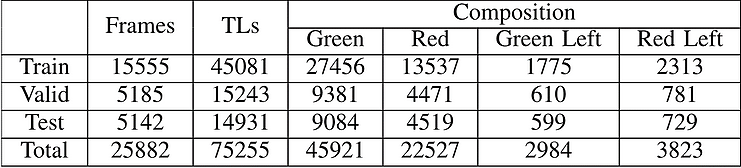
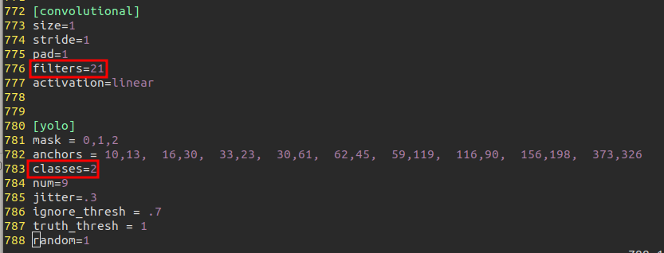
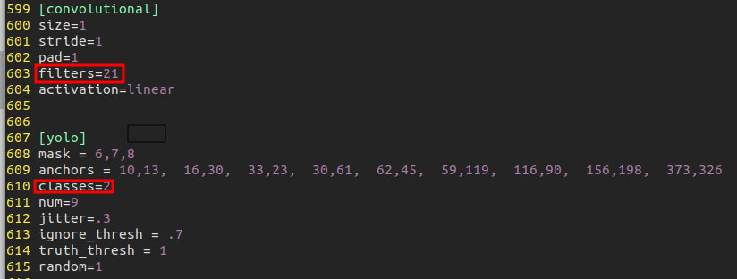
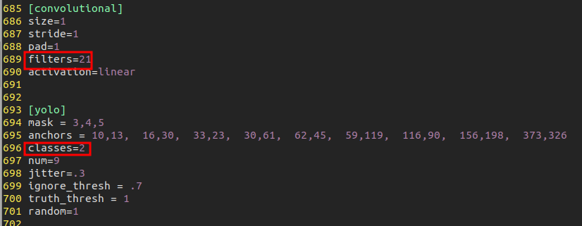

# Darknet Manual

ubuntu 18.04 환경에서 darknet을 이용하여 Custom data를 학습시켜보겠습니다. 

간단하게 신호등 색(Green, Red)을 학습하려고 합니다.

사전에 CUDA, CUDNN, Opencv, python3.6 설치가 되어있어야 합니다.

출처 : [darknet으로 Gaussian YOLOv3 학습하기](https://eehoeskrap.tistory.com/399?category=705416)

## 1. darknet 다운로드

- git 복제하기

  ~~~
  $ git clone https://github.com/AlexeyAB/darknet.git
  ~~~

## 2. 컴파일

- make를 이용하여 컴파일하기

  MakeFile에서 GPU, CUDNN, CUDNN_HALF, OPENCV 값을 1로 변경합니다. (사용을 위함)

  ~~~
  $ cd darknet
  $ vi MakeFile
  GPU=1 
  CUDNN=1 
  CUDNN_HALF=1 
  OPENCV=1 
  AVX=0 
  OPENMP=0 
  LIBSO=0 
  ZED_CAMERA=0
  $ make
  ~~~

## 3. 데이터셋 준비하기

학습하고자 하는 데이터가 신호등이므로 신호등 이미지가 있어야 하며

라벨링을 위한 Tool을 다운로드합니다.

- 데이터셋 다운로드

다운로드 바로가기 : [traffic-light-dataset(20GB)](https://www.acelab.org/traffic-light-dataset)

- 라벨링 툴 다운로드

다운로드 바로가기 : [awesome-data-labeling](https://github.com/heartexlabs/awesome-data-labeling)

필자의 경우 [labelImg](https://github.com/tzutalin/labelImg)와 [Yolo_mark](https://github.com/AlexeyAB/Yolo_mark) 툴을 이용하였으며, 각자 편하다고 생각하는 툴을 사용하면 됩니다. 

나중에 [imglab](https://github.com/NaturalIntelligence/imglab)을 이용해보려고 합니다.(Segmentation까지 가능)

## 4. 주요 파일 구성

- [obj.data](#obj.data)
- [obj.cfg](obj.cfg)
- [obj.names](obj.names)
- [weight file](weight file)
- [images](images)
- [annotation](annotation)
- [train.txt](train.txt)
- [valid.txt](valid.txt)

### obj.data

---

- 학습을 위한 내용이 담겨있는 파일
- classes 개수, train.txt 와 valid.txt 의 경로, obj.names 의 경로, weight를 저장할 폴더의 경로로 이루어짐

~~~
$ cd darknet/data
$ vi obj.data
classes= 2
train  = data/train.txt
valid  = data/valid.txt
names = data/obj.names
backup = backup/
~~~

### obj.cfg

---

- 모델 구조 및 train 과 관련된	 설정이 들어있는 파일
- batch 및 subdivisions 사이즈(Cuda Memory 관련), width 및 height 사이즈(입력 값 및 성능 관련)
- augmentation(angle, saturation, exposure, hue) 설정
- learning rate, burn_in, max_batches, policy, steps, scales 설정
- filters : (4 + 1 + class 수) * 3 설정
- classes : class 수 설정
- anchors 및 mask 설정

~~~
$ vi yolov3.cfg
수정 할 것
- batch
- subdivisions
- max_batches
- steps

esc키 누르고 :/yolo 입력
N을 누르면 yolo가 적힌 줄로 이동한다.
~~~

### obj.names

---

- annotation에 포함되어있는 라벨링 이름 목록 즉, 검출하고자 하는 목록

~~~
$ vi obj.names
light_Green
light_Red 복사
~~~

### weight file

---

- 특정 미리 트레이닝된 모델(pre-trained model) 또는 기본적으로 [darknet53.conv.74](https://eehoeskrap.tistory.com/darknet53.conv.74) 등의 가중치 파일
- fine-tuning을 위해 맨 아래 레이어를 제거(AlexeyAB darknet에 내장)한 가중치 파일을 사용할 수도 있음

### images

---

- 학습시킬 이미지들
- valid image는 train image의 10 ~ 20% 정도로 설정
- txt파일과 같은 경로에 있어야 합니다.

### annotation

---

- 학습시킬 이미지들에 대한 주석들

- 각 이미지마다 txt 파일이 필요합니다.

  ~~~
  [class_id] [center_x] [center_y] [w] [h]
  ~~~

### train.txt

---

- 학습 시킬 이미지들의 경로들이 담긴 리스트

  경로를 정확하게 기입해야 합니다.

~~~
예시
data/img/traffic_test_00001.jpg
~~~

### valid.txt

---

- 학습 시 validation 할 이미지들의 경로들이 담긴 리스트

  경로를 정확하게 기입해야 합니다.

  

## 5. 학습 실행하기

~~~
$ ./darknet detector train data/obj.data cfg/yolov3.cfg darknet53.conv.74 -gpu 0 -map
~~~

-gpu 0 : gpu 1개 사용

-map : 학습이 잘 되는지 그래프로 확인

- backup 디렉토리 안에 가중치 데이터 결과가 저장됩니다.

## 6. 결과 보기

~~~
$./darknet detector test data/obj.data cfg/yolov3.cfg backup/yolov3.weights data/img/sample_image.jpg
$./darknet detector demo data/obj.data cfg/yolov3.cfg backup/yolov3.weights data/media/example.mp4
$./darknet detector demo data/obj.data cfg/yolov3.cfg backup/yolov3.weights
~~~

