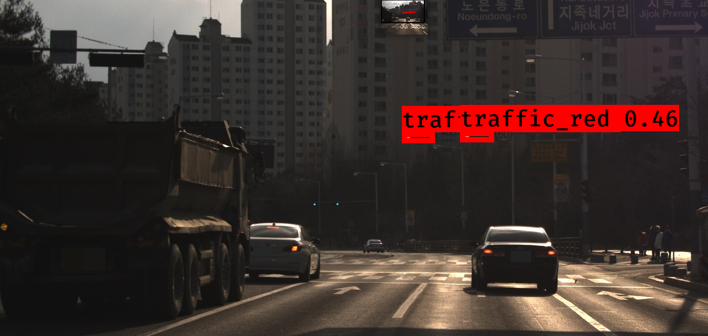
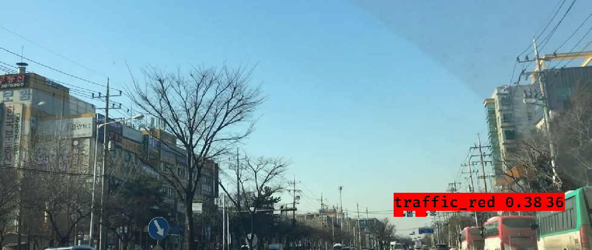

# keras-yolo3

keras로 yolov3 모델 학습 시키기 ([keras-yolo3](https://github.com/qqwweee/keras-yolo3.git))

작성자 : 진대종 ([github](https://github.com/jdj2261))

출처 : https://nero.devstory.co.kr/post/pj-too-real-03/

> Environment
>
> - Ubuntu Version : 18.04
> - CUDA Version : 10.0
> - cuDNN Version :  7.6.5
>

### 1. 가상환경 생성 및 활성화

해당 가상환경이 활성화되어 있어야 함.

필자의 경우 

~~~
$ virtualenv keras-yolov3
$ source keras-yolov3/bin/activate
~~~

### 2. git 복제하기

~~~
$ git clone https://github.com/qqwweee/keras-yolo3.git
~~~

### 3. pip 패키지 설치

IPython, pillow, matplotlib, tensorflow==1.15.0, tensorflow-gpu==1.15.0

keras==2.2.4, h5py==2.10.0

~~~
$ pip install -r requirements.txt
~~~

### 4. 다크넷 모델을 케라스 모델로 변환

 Yolo3는 C/C++로 구현된 DarkNet 프레임워크로 구현되어 있으므로 Keras에서 사용하기 위해 .h5 포맷으로 변환해야 함.

필요한 것 : custom yolov3.cfg 파일, 가중치 파일 

필자의 경우 신호등을 인식하기 위해 수정한 cfg파일과 학습 후 생성된 가중치 파일을 이용함. 

위 파일들을 keras-yolo3 디렉토리 안에 복사해서 사용해도 되고

 해당 파일 경로를 입력해도 됨

~~~
$ python3 convert.py ~/Mywork/origin_darknet/cfg/yolov3.cfg ~/Mywork/origin_darknet/backup/yolov3_final.weights model_data/test.h5
~~~

> Convert darknet model to keras model
>
> -  yolov3.cfg (Darknet에서 사용하는 모델 구조 정의 파일)
> - yolov3_final.weights (Darknet으로 학습된 모델 파일) 
> - test.h5 (keras 학습 모델 )

### 5. Annotation 포맷으로 변환

Row format: `image_file_path box1 box2 ... boxN`;
Box format: `x_min,y_min,x_max,y_max,class_id` (no space).

> Annotation Format
>
> path/to/img1.jpg 50,100,150,200,0 30,50,200,120,3
>
> path/to/img2.jpg 120,300,250,600,2

> data 폴더 내 tree 구조
>
> └── traffic_light
>     ├── classes.txt
>     ├── image
>     └── train.txt

~~~
$ mkdir -p data/traffic_light
classes.txt, train.txt 파일 복사
image 디렉토리 복사
~~~

- 필자의 annotation 변환 예시

~~~
1. classes.txt
	traffic_green
	traffic_red
2. image
	traffic_000001.jpg
	raffic_000002.jpg
	raffic_000003.jpg
3. train.txt
	./data/traffic_light/image/traffic_000001.jpg 380,559,428,583,0
	./data/traffic_light/image/traffic_000002.jpg 380,559,428,583,0
	./data/traffic_light/image/traffic_000003.jpg 380,559,428,583,0
~~~

- train.txt 생성 방법

  1) DeepLearning_LIB git 복제 

  ~~~
  $ git clone https://github.com/jdj2261/DeepLearning_LIB.git
  $ cd DeepLearning_LIB
  ~~~

  2)  파일 이름 변경 (이미지 파일, 텍스트 파일)

  python3 change_filename.py --change $(해당디렉토리) --after $(변경할 파일 이름) --type $(파일 타입)

  ~~~
  $ python3 change_filename.py --change /home/djjin/Test/images --after traffic_ --type jpg
  ~~~

  3) train.txt 만들기

  - python3 make_train_for_keras.py --make_train $(해당디렉토리(txt 파일이 들어있는 디렉토리))

    ~~~
    $ python3 make_train_for_keras.py --make_train /home/djjin/Test/labels
    ~~~

    > train.txt example (맨 끝 인덱스가 0이면 green, 1이면 red)
    >
    > test_000030.jpg 380,559,428,583,0
    > test_000030.jpg 480,572,530,593,0

### 6. 학습 실행

train.py 파일의 _main() 부분을 수정 후 학습을 진행합니다.

> train.py의 _main()
>
> ~~~
> annotation_path = 'data/traffic_light/train.txt'
> log_dir = 'logs/000/'
> classes_path = 'data/traffic_light/classes.txt'
> anchors_path = 'model_data/yolo_anchors.txt'
> ~~~

~~~
$ python3 train.py
~~~

### 7. 데모

#### 7-1. 이미지 실행

~~~
$ python3 yolov3_keras_demo.py --image ~/Test/merge/images/test_000405.jpg 
~~~

---

#### 7-2. 비디오 실행

~~~
$ python3 yolov3_keras_demo.py --video ~/Videos/dwelling.mp4
~~~

