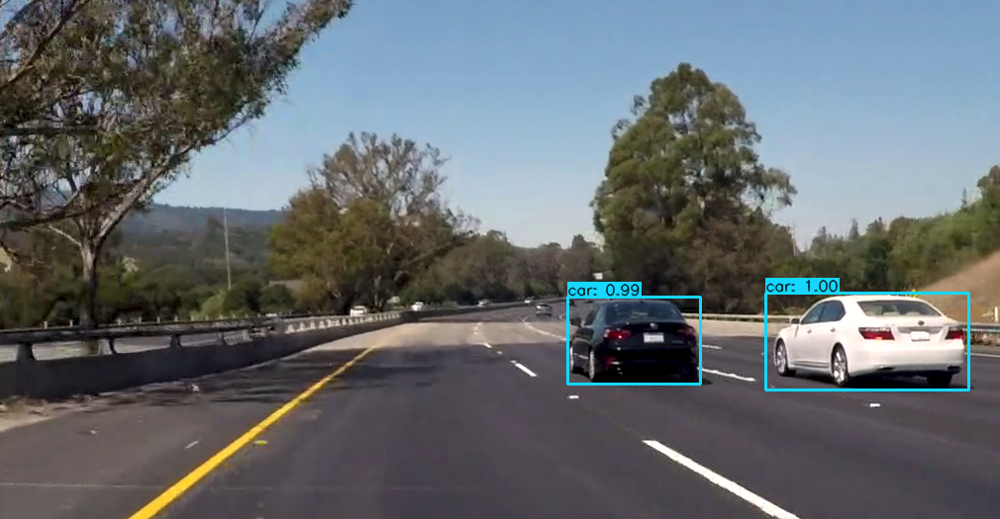
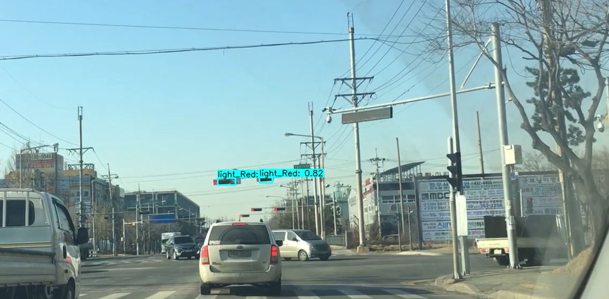
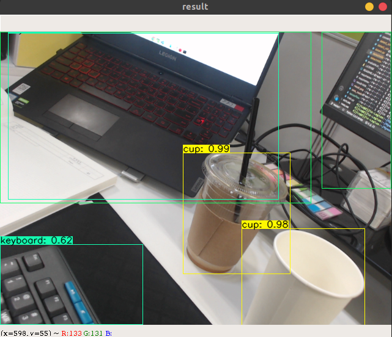

# tensorflow-yolov4-tflite 

tensorflow에서 yolov3, yolov4 돌려보기

작성자 : 진대종 ([github](https://github.com/jdj2261))

출처 : https://deepflowest.tistory.com/181

Download yolov4.weights file: [다운로드 링크](https://drive.google.com/open?id=1cewMfusmPjYWbrnuJRuKhPMwRe_b9PaT)

Environment

- Ubuntu Version : 18.04
- CUDA Version : 10.0
- cuDNN Version :  7.6.5

### 1. 가상환경 생성 및 활성화

해당 가상환경이 활성화되어 있어야 함.

필자의 경우 

~~~
$ virtualenv tensorflow-yolov4-tflite
$ source tensorflow-yolov4-tflite/bin/activate
~~~

### 2. git 복제하기

~~~
$ git clone https://github.com/hunglc007/tensorflow-yolov4-tflite
~~~

[이 링크](https://drive.google.com/open?id=1cewMfusmPjYWbrnuJRuKhPMwRe_b9PaT )에서 yolov4.weights 파일 다운로드 후 tensorflow-yolov4-tflite\data에 복사

### 3. pip 패키지 설치

~~~
$ cd tensorflow-yolov4-tflite
$ pip install -r requirements.txt
$ pip install -r requirements-gpu.txt
~~~

### 4. 다크넷 가중치 파일 변환

- tensorflow 버전으로 변환

  ~~~
  $ python save_model.py --weights ./data/yolov4.weights --output ./checkpoints/yolov4-416 --input_size 416 --model yolov4
  ~~~

  - Custom 데이터인 경우 (필자의 경우 신호등 색 분류 : Red / Green)

    [이 링크](https://drive.google.com/file/d/1hMuYb1WpkIsJU9u_5R3hMboBNVRxb3Ub/view?usp=sharing)에서 yolov4_last.weights 파일 다운로드 후 tensorflow-yolov4-tflite\data에 복사

    ~~~
    $ python save_model.py --weights ./data/yolov4_last.weights --output ./checkpoints/yolov4-416-test --input_size 416 --model yolov4
    ~~~

    checkpoint 디렉토리안에 yolov4-traffic-light 폴더가 있는지 확인

    pb 파일은 모델 구조와 가중치 값이 합쳐진 파일이므로 재학습이 불가능하다.

    tensorflow 기반으로 만들어진 모델을 모바일이나, C++ 프로그램에서 사용하고자 할 때 사용되는 파일 형식이다. (TensorRT를 위해서 사용될 수 있다.)

    참조 : [pb 설명](https://eehoeskrap.tistory.com/343)

- tflite 버전으로 변환

  ~~~
  $ python save_model.py --weights ./data/yolov4.weights --output ./checkpoints/yolov4-416 --input_size 416 --model yolov4 --framework tflite
  $ python save_model.py --weights ./data/yolov4.weights --output ./checkpoints/yolov4-416 --input_size 416 --model yolov4 --framework tflite
  ~~~

- tensorRT 버전으로 변환

  ~~~
  $ python save_model.py --weights ./data/yolov4.weights --output ./checkpoints/yolov4.tf --input_size 416 --model yolov4
  $ python convert_trt.py --weights ./checkpoints/yolov4.tf --quantize_mode float16 --output ./checkpoints/yolov4-trt-fp16-416
  ~~~

### 5. config.py 수정

coco dataset을 사용할 경우 수정할 필요가 없지만 Custom dataset을 사용할 경우 수정을 해야합니다.

darknet에서 수정했던 names 파일을 data/classes 디렉토리 안으로 복사합니다.

~~~
$ cd core
$ vi config.py
14 번째 줄 수정
coco : __C.YOLO.CLASSES = "./data/classes/coco.names" 
custom : __C.YOLO.CLASSES = "./data/classes/obj.names" 
~~~

### 6. 데모

#### 6-1. 이미지

- yolov4 일반 버전

  ~~~
  $ python detect.py --weights ./checkpoints/yolov4-416 --size 416 --model yolov4 --image ./data/kite.jpg
  ~~~

  - Custom 데이터

    ~~~
    $ python detectvideo.py --weights ./checkpoints/yolov4-416-test --size 416 --model yolov4 --video ~/Videos/dwelling.mp4 
    ~~~

    

---

#### 6-2. 비디오

- yolov4 일반 버전

  ~~~
  $ python detectvideo.py --weights ./checkpoints/yolov4-416 --size 416 --model yolov4 --video ./data/road.mp4
  ~~~

  

  - Custom 데이터

  ~~~
  $ python detectvideo.py --weights ./checkpoints/yolov4-416-test --size 416 --model yolov4 --video ~/Videos/dwelling.mp4 
  ~~~

  

---

#### 6-3. 실시간 Webcam

- yolov4 일반 버전

  ~~~
  $ python detectvideo_webcam.py weights ./checkpoints/yolov4-416 size 416 model yolov4
  ~~~

  

  