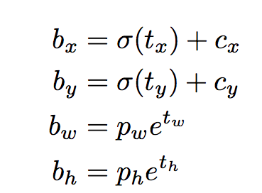
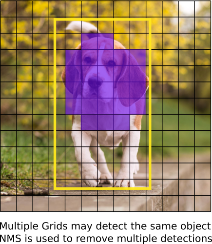

# Pytorch로 처음부터 구현해보기 (Part1)

pytorch-yolo-v3 설치 및 데모 실행하기 

> 참고
>
> [How to implement a YOLO(v3) object detector from scratch in PyTorch ](https://github.com/ayooshkathuria/pytorch-yolo-v3)(영어)
>
> [YOLO(v3) object detector를 Pyotrch로 처음부터 구현해보기](https://devjin-blog.com/yolo-part1/)(한글 번역)

작성자 : 진대종 ([github](https://github.com/jdj2261))

> Environment
>
> - Ubuntu Version : 18.04
> - CUDA Version : 10.0
> - cuDNN Version :  7.6.5

## 1. Prerequisites

- Convolutional Neural Network(CNN)이 어떻게 작동하는지 이해해야 한다.

  Residual blocks, skip connections, `upsampling`에 대한 지식들도 포함한다.

- Object detection, bounding box regression, IoU 그리고 non-maximum suppression이 무엇인지 이해해야 한다.

- 기본적으로 Pytorch 사용법을 알아야하고, 간단한 neural network 정도는 직접 구현할 줄 알아야 한다.

### 1-1. YOLO란 무엇인가?

- YOLO는 You Only Look Once(딱 한번만 본다)의 줄임말이다. 

  deep CNN으로 학습한 feature들로 object들을 detect하는데 사용된다.

### 1-2. A Fully Convolutional Neural Network(FCN)

- YOLO는 convolutional layers들만 사용하여 FCN을 만든다. skip connections와 `upsampling` layer들을 포함해 총 75개의 convolutional layer들로 구성된다.

  `Pooling`은 사용되지 않고, feature map을 downsample 하기 위해서 2의 stride를 가진 convolutional layer가 사용된다. 이는 `Pooling`으로 인해서 low-level feature들이 자주 loss되는 것을 방지하기 위함이다. 

- FCN이기 때문에 YOLO는 입력 이미지 크기에 영향을 받지 않는다. (다시 말해서, 이미지 크기에 따라 네트워크가 빨라지거나 느려지지 않는다.)

  그러나, 알고리즘을 구현할 때 다양한 문제들이 일어날 수 있기 때문에 일정한 입력 크기를 유지한다.

- batch로 이미지를 처리하려고 하면 모든 이미지들의 높이와 너비가 고정되어 있어야 하며, 여러 이미지를 하나의 큰 batch로 연결하기 위해 필요하다.

- 네트워크는 `stride`라는 factor를 통해 이미지를 `downsample`한다. 예를 들어, 네트워크의 stride가 32이면, 416x416 크기의 입력 이미지는 13x13 크기의 출력을 생성할 것이다.

### 1-3. Interpreting the output

- YOLO에서 prediction은 1x1 convolutional layer을 사용해서 이뤄진다.

  따라서, 출력 결과는 feature map이라는 것이며 prediction map 크기도 feature map 크기와 같다.

  Yolo v3에서 각 cell은 고정된 숫자의 bounding box를 예측할 수 있고 이러한 방법으로 prediction map을 예측할 수 있게 된다.

- 깊이를 봤을 때, (B x (5+C))개의 entry가 feature map안에 있다.  B는 각 cell이 예측할 수 있는 bounding box들의 숫자를 표현한다.

  논문에 의하면, B bounding box들은 특정 종류의 object들을 detect하는 데 특화될 수 있다.

  각각의 bounding box들은 5+C개의 attributes(속성)들을 가지고 있고, 이 속성들은 bounding box의 중심 좌표, dimension(크기), objectness 점수, C class 신뢰도를 표현한다. YOLOv3는 각 cell당 3개의 bounding box를 예측한다.

- **Object의 중심이 cell의 receptive field에 있는 경우, feature map의 각 cell이 bounding box중 하나를 이용해서 object를 예측할 것이다.**

  Yolo가 trained된 방법과 관련이 있다. 여기서, 단 하나의 bounding box만 주어진 object를 감지한다.

- 그러기 위해서, 입력 이미지를 최종 feature map 크기와 같게 grid로 나누어야 한다.

  예를 들어 입력 이미지는 416x416이고 네트워크 stride는 32이 일때, feature map의 dimension은 13x13이 될것이다.

  따라서, 입력 이미지를 13x13으로 나눈다.

  

- 이후, object의 ground truth box 중심을 포함한 cell은 object를 예측하는 대상으로 선정이 된다.

  위 이미지에서는 빨간색으로 마크된 cell이고, 이 cell은 노란색으로 마크된 ground truth box의 중심을 포함한다.

  빨간 cell은 grid의 (7,7)에 위치하고 이 cell을 feature map에서 개를 detect하는 것을 책임지는 cell로 지정한다.

- 이 cell은 총 3개의 bounding box를 예측할 수 있다. 그렇다면, 어떤 box가 개의 ground truth label로 배정 될까?
0.
  이 질문을 이해하기 위해 anchors에 대한 개념을 짚고 넘어가자.

### 1-4. Anchor Boxes

- Bounding box의 높이와 너비를 예측하는 것이 의미가 있을 수도 있지만, 실제로 학습 시 불안정한 gradient를 발생시킨다.

  최근 object detector들은 log-space transforms를 예측하거나 anchors라고 불리는 미리 정의된 bounding box들을 사용한다.

- 이러한 변환을 앵커 상자에 적용하여 예측값을 얻게 되고 YOLOv3는 3개의 anchors가 있으므로 셀당 세 개의 경계 상자를 예측한다.

- 개를 감지하는 bounding box는 ground turth box와 함께 가장 높은 `IoU`를 가진 anchor가 되는 것이다.

### 1-5. Making Predictions

- *bx, by, bw, bh* 는 prediction의 x,y의 중심 좌표, 너비와 높이이다. tx, ty, tw, th는 네트워크의 출력이다. cx and cy 는 grid의 왼쪽 위 좌표이다. pw 와 ph는 box의 anchor dimension이다.

#### 1-5.1. Center Coordinates

- sigmoid 함수를 통해 중심 좌표 예측을 할 수 있고, 출력 값은 0과 1 사이가 된다.이 경우 문제가 된다. 왜?

  일반적으로 YOLO는 bounding box 중심의 절대 좌표를 예측하는게 아니고 offset들을 예측한다.

  - object를 예측하는 grid cell의 왼쪽 위 코너에 상대적인 offset
  - Feature map에서 cell의 dimension에 의해 정규화된 offset, 즉 1.
  
- 위 사진을 예를 들어, 중심이 (0.4, 0.7)로 예측이 되었다면 이는 중심이 13x13 feature map 위에 (6.4, 6.7)에 있다는 의미이다. (빨간색 cell의 왼쪽 위 좌표가 (6,6) )

  만약 x, y 좌표가 1보다 크고 값이 (1.2, 0.7)인 경우 중심이 (7.2, 6.7)에 있게 되는데 이경우는 빨간 cell 바로 옆 cell에 있음을 알 수 있다.
  
  이 경우,  **YOLO의 이론을 깨뜨린다."** 왜냐? 만약 빨간 cell이 개를 예측하는 역할을 한다고 가정한다면, 개의 중심은 다른 cell에 위치할게 아니라 무조건 빨간 cell 위에 위치해야 하기 때문이다.
  
- 이 문제를 해결하기 위해 **sigmoid function**을 거쳐서 0과 1사이의 값으로 만들어지고, 이로 인해 object의 중심 좌표가 중심 cell에 언제나 유지될 수 있다.

  (sigmoid function 사용 이유)

#### 1-5.2. Bounding Box의 Dimensions

- 위의 식을 볼때, Bounding Box의 dimensions는 log-space transform을 출력 값에 적용한 다음 anchor에 곱함으로써 예측이 이루어진다.

- 예측된 결과, bw 및 bh는 이미지의 높이와 너비로 정규화 된다.

  따라서, 개를 담고있는 box의 bx와 by 예측값이 (0.3, 0.8)이라면, 13x13 feature map에서의 실제 너비와 높이는 (13x0.3, 13.08)이다.

#### 1-5.3. Objectness Score

- object score는 obeject가 bounding box에 포함될 확률을 나타내며, 빨간색과 인접한 grid의 경우 거의 1이 되어야 하며, 모서리에 있는 그리드의 경우 거의 0이어야 한다.
- 객관성 점수는 확률로 해석되기 때문에 **sigmoid function**을 거친다.

#### 1-5.4. Class Confidences(학습 신뢰도)

- 학습 신뢰도는 detect된 object가 특정 클래스 (개, 고양이, 자동차 등)에 속하는 확률을 나타낸다.

  V3 이전 버전에서는 class score를 얻기 위해 `softmax`가 사용 되었다.

  하지만, v3에서는 sigmoid를 사용하기로 하였고 이유는? 여성과 사람과 같은 class 부류 때문이다.

  일반적으로 Class 점수들을 softmaxing 하는 것은 class들이 상호 배타적이라고 가정하기 때문인데,

  간단히 말해, 한 객체가 특정 클래스에 속하면 다른 클래스에 속하지 않는다는 것이 보장된다.

  그러나 **여성과 사람과 같은 클래스는 이 가정에 맞지 않는다! 그래서 sigmoid를 사용하는 것**

### 1-6. Prediction across different scales

- YOLOv3는 3가지의 다른 scale에 대해 prediction을 한다. Detection layer는 3가지의 다른 크기를 가진 feature map(32, 16, 8인 stride)을 detect 한다.

  즉, 416x416 입력일 때, 13x13, 26x26, 52,52 크게에 detection을 한다는 것이다.

- 네트워크는 첫 번째 detection layer까지 입력 이미지를 다운 샘플링한다. 이 layer에서 detection은 stride 32를 가진 layer의 feature map을 사용해서 이루어진다.

  또한 계층은 2배로 업 샘플링이 되고 동일한 feature map 크기를 가진 이전 layer의 feature map과 연결된다. 이제 stride가 16인 layer에서 또 다른 detection이 이뤄지고 동일한 업 샘플링 절차가 반복 된후 최종 detection은 stride 8을 가진 layer에서 이뤄진다.

- 각 scale에서 각 cell들은 3개의 anchor를 사용하여 3개의 bounding box를 예측한다. 따라서 anchor 총 합은 9가 된다. (anchor는 scale에 따라 다름.)

  

### 1-7. Output Processing

- 416x416 크기를 가진 이미지에 대해 YOLO는 총 ((52x52) + (26x26) + (13x13)) x 3 = 10647 개의 bounding box들을 예측한다.

  하지만 우리가 고려하고 있는 이미지 경우 하나의 object만 존재한다.

  **어떻게 10647개의 detection을 1로 줄일 수 있을까?**

#### 1-7.1. Thresholding by Object Confidence

- 먼저 objectness score를 기준으로 box들을 필터링한다. 일반적으로 임계 값 미만인 box는 무시한다.

#### 1-7.2 Non-maximum Suppression

- NMS는 동일한 이미지를 여러번 detection하는 것을 방지한다.

  예를 들어, 빨간 grid cell의 3개의 bounding box 모두가 box를 detect 할 수 있고, 인접한 cell이 동일한 object를 detection할 수 있다.

  

## 2. Our Implementation

- Yolo는 네트워크 훈련 시 사용된 dataset에 있는 class에 속하는 객체만 감지할 수 있다.

  공식적으로 제공하는 weight 파일을 사용할 것이고 이 weight 파일은 coco dataset으로 train 된 네트워크이고 80개의 object들을 detect할 수 있따.

  다음 [Part2](Pytorch로 처음부터 구현해보기(part2).md)에는 다양한 layer들을 구현할 예정이다.

## 3. Further Reading

1. [YOLO V1: You Only Look Once: Unified, Real-Time Object Detection](https://arxiv.org/pdf/1506.02640.pdf)
2. [YOLO V2: YOLO9000: Better, Faster, Stronger](https://arxiv.org/pdf/1612.08242.pdf)
3.  [YOLO V3: An Incremental Improvement](https://pjreddie.com/media/files/papers/YOLOv3.pdf)
4. [Convolutional Neural Networks](http://cs231n.github.io/convolutional-networks/)
5.  [Bounding Box Regression (Appendix C)](https://arxiv.org/pdf/1311.2524.pdf)
6. [IoU](https://www.youtube.com/watch?v=DNEm4fJ-rto)
7. [Non-maximum Suppression](https://www.coursera.org/lecture/convolutional-neural-networks/non-max-suppression-dvrjH)
8. [PyTorch Official Tutorial](http://pytorch.org/tutorials/beginner/deep_learning_60min_blitz.html)

## Terms

- Upsampling은 신호의 샘플링 주기를 높이는 것이다. [1 2 3 4 5]의 신호가 있을 때 샘플링 주기를 3배로 업샘플링한다면 [1 0 0 2 0 0 3 0 0 4 0 0 5 0 0]이 된다. 업샘플링 후에는 LPF(Low Pass Filter)로 인터폴레이션(Interpolation)을 하여야 한다.

- Downsampling은 신호의 샘플링 주기를 낮추는 것이다. [1 2 3 4 5 6 7 8 9 10 11 12]의 신호가 있을 때 샘플링 주기를 1/3로 다운샘플링한다면 [1 4 7 10]이다. 다운샘플링 전에는 LPF로 주파수를 낮춰야 한다. 다운샘플링을 데시메이션(Decimation)이라고도 한다.

- pooling 사용 이유 

  이미지의 크기를 계속 유지한 채 레이어로 가게 된다면 연산량이 기하급수적으로 늘게되며, 적당량의 data만 있어도 된다. 
  
  parameter를 줄이기 때문에, 해당 network의 표현력이 줄어들어 Overfitting을 억제하고 hardware resource를 절약하고 속도가 향상된다.
  
  최대 단점은 방향이나 비율이 달라지면 서로 다른 객체로 인식한다. 이를 개선하고자 다양한 방식이 나오게 되지만 학습시간이 증가하는 단점이 있다.
  
- stride는 필터가 이동할 간격을 말한다.

- [softmax](https://yamalab.tistory.com/87)